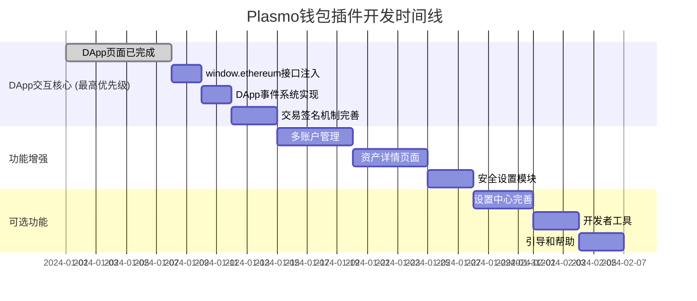

# 📊 Plasmo 钱包插件完整页面需求分析

## 📋 项目概述

基于 DApp 交互设计文档和现有项目结构，分析完成一个功能完整的区块链钱包插件所需的页面数量和架构。

## 🎯 当前状态分析

### ✅ 现有页面 (7个)
```typescript
src/pages/
├── WalletPage.tsx          // ✅ 钱包主页
├── AssetsPage.tsx          // ✅ 资产页面
├── SettingsPage.tsx         // ✅ 设置页面
├── TestPage.tsx            // ✅ 测试页面
├── PasswordPage.tsx        // ✅ 密码页面
├── ErrorTestPage.tsx       // ✅ 错误测试页面
└── ...

src/components/
├── BalanceDisplay.tsx      // ✅ 余额显示
├── AssetCategoryTabs.tsx   // ✅ 资产分类标签
├── NetworkSelector.tsx     // ✅ 网络选择器
├── WalletStatus.tsx        // ✅ 钱包状态
├── BottomNavigation.tsx    // ✅ 底部导航
└── ...
```

### 🏗️ 当前架构优势
- ✅ Plasmo 框架完整搭建
- ✅ 基础钱包功能实现
- ✅ 数据持久化问题解决
- ✅ 组件化架构清晰
- ✅ 路由系统完整

## 🚀 完整插件页面需求

### 📊 总计需求：**30个页面/组件**

#### **1. 核心功能页面 (12个)**

##### 📱 钱包管理 (3个页面)
```typescript
src/pages/wallet/
├── WalletPage.tsx              // ✅ 现有 - 钱包主页
├── MultiAccountPage.tsx        // 🆕 多账户管理
│   ├── 账户列表展示
│   ├── 账户创建/切换
│   └── 账户重命名
├── AccountImportPage.tsx       // 🆕 账户导入页面
│   ├── 私钥导入
│   ├── 助记词导入
│   ├── Keystore导入
│   └── 硬件钱包连接
└── SecurityPage.tsx           // 🆕 安全设置页面
    ├── 密码设置/修改
    ├── 生物识别设置
    ├── 两步验证
    └── 自动锁屏设置
```

##### 💰 资产管理 (3个页面)
```typescript
src/pages/assets/
├── AssetsPage.tsx              // ✅ 现有 - 资产总览
├── TokenDetailsPage.tsx        // 🆕 代币详情页面
│   ├── 代币信息展示
│   ├── 价格图表
│   ├── 交易历史
│   └── 添加/移除
├── NFTCollectionPage.tsx       // 🆕 NFT收藏页面
│   ├── NFT列表展示
│   ├── NFT详情查看
│   └── NFT收藏管理
└── TransactionHistoryPage.tsx  // 🆕 交易历史
    ├── 发送/接收记录
    ├── 失败交易记录
    └── 交易详情查看
```

##### 🔗 DApp交互 (4个页面)
```typescript
src/pages/dapp/
├── ConnectionRequestsPage.tsx // 🆕 DApp连接请求管理
│   ├── 待处理连接列表
│   ├── 已授权连接管理
│   ├── 连接风险提示
│   └── 权限设置
├── PermissionsPage.tsx          // 🆕 权限管理页面
│   ├── DApp权限列表
│   ├── 权限编辑/撤销
│   ├── 风险评估
│   └── 批量管理
├── TransactionConfirmPage.tsx  // 🆕 交易确认页面
│   ├── 交易详情展示
│   ├── Gas费用估算
│   ├── 风险警告提示
│   └── 确认/取消操作
└── SignatureConfirmPage.tsx    // 🆕 签名确认页面
    ├── 签名内容展示
    ├── 风险提示
    ├── 详细信息查看
    └── 确认/取消操作
```

##### 🌐 网络管理 (2个页面)
```typescript
src/pages/network/
├── NetworkManagerPage.tsx      // 🆕 网络管理主页面
│   ├── 网络列表展示
│   ├── 网络信息编辑
│   ├── 默认网络设置
│   └── 网络连接状态
└── AddNetworkPage.tsx          // 🆕 添加自定义网络
    ├── 网络信息表单
    ├── RPC URL测试
    ├── 链ID验证
    └── 添加确认
```

#### **2. 设置中心页面 (6个)**

##### ⚙️ 通用设置 (3个页面)
```typescript
src/pages/settings/
├── GeneralSettingsPage.tsx      // 🆕 通用设置
│   ├── 语言设置
│   ├── 主题设置
│   ├── 通知设置
│   └── 基础配置
├── SecuritySettingsPage.tsx   // 🆕 安全设置
│   ├── 密码策略
│   ├── 自动锁定时间
│   ├── 生物识别
│   └── 安全警告级别
└── AdvancedSettingsPage.tsx   // 🆕 高级设置
    ├── 开发者模式
    ├── 实验性功能
    ├── 性能优化
    └── 调试选项
```

##### 🛠️ 开发者工具 (3个页面)
```typescript
src/pages/developer/
├── DebugPage.tsx               // 🆕 调试工具页面
│   ├── 控制台输出
│   ├── 状态检查器
│   ├── 网络请求监控
│   └── 错误日志查看
├── DAppBrowserPage.tsx         // 🆕 DApp浏览器页面
│   ├── DApp连接状态
│   ├── 权限查看器
│   ├── 事件监听器
│   └── RPC调用追踪
└── TestRPCPage.tsx             // 🆕 RPC测试页面
    ├── 方法测试器
    ├── 参数构建器
    ├── 结果查看器
    └── 批量测试
```

#### **3. 引导和帮助页面 (4个)**

##### 📖 用户引导 (4个页面)
```typescript
src/pages/help/
├── WelcomePage.tsx             // 🆕 首次使用引导
│   ├── 功能介绍
│   ├── 安全提示
│   ├── 快速开始
│   └── 账户创建流程
├── HelpPage.tsx                // 🆕 帮助文档
│   ├── 使用教程
│   ├── 常见问题
│   ├── 视频教程
│   └── 社区支持
├── AboutPage.tsx               // 🆕 关于页面
│   ├── 版本信息
│   ├── 团队介绍
│   ├── 开源许可
│   └── 联系方式
└── PrivacyPage.tsx             // 🆕 隐私政策页面
    ├── 数据收集说明
    ├── 使用权限说明
    ├── 数据保护措施
    └── 用户权利
```

### 🎭 交互确认组件 (8个模态框)

#### 💬 用户确认 (8个模态框)
```typescript
src/components/modals/
├── ConnectionModal.tsx          // 🆕 DApp连接确认
│   ├── DApp信息展示
│   ├── 权限请求列表
│   ├── 风险警告
│   └── 连接/拒绝按钮
├── TransactionModal.tsx         // 🆕 交易确认模态框
│   ├── 交易详情
│   ├── Gas费用
│   ├── 金额显示
│   └── 确认/取消
├── SignatureModal.tsx           // 🆕 签名确认模态框
│   ├── 签名内容
│   ├── 原始数据
│   ├── 风险提示
│   └── 确认/取消
├── NetworkSwitchModal.tsx      // 🆕 网络切换确认
│   ├── 目标网络信息
│   ├── 切换原因说明
│   ├── 风险提示
│   └── 切换/取消
├── AddTokenModal.tsx           // 🆕 添加代币模态框
│   ├── 代币搜索
│   ├── 代币信息
│   ├── 添加确认
│   └── 自定义代币
├── ImportAccountModal.tsx       // 🆕 导入账户模态框
│   ├── 导入方式选择
│   ├── 数据输入表单
│   ├── 验证过程
│   └── 导入结果
├── SecurityModal.tsx            // 🆕 安全验证模态框
│   ├── 密码输入
│   ├── 生物识别
│   ├── 验证进度
│   └── 验证结果
└── ErrorModal.tsx               // 🆕 错误提示模态框
    ├── 错误信息
    ├── 详细描述
    ├── 解决建议
    └── 关闭按钮
```

## 📈 需求统计汇总

### 📊 页面数量统计表

| 类别 | 当前数量 | 需要新增 | 总计 | 完成度 |
|------|----------|----------|------|--------|
| **核心功能页面** | 2 | 10 | 12 | 16.7% |
| **设置中心页面** | 1 | 5 | 6 | 16.7% |
| **开发者工具页面** | 0 | 3 | 3 | 0% |
| **引导帮助页面** | 0 | 4 | 4 | 0% |
| **交互确认组件** | 0 | 8 | 8 | 0% |
| **总计** | **3** | **30** | **33** | **9.1%** |

### 🎯 开发优先级矩阵

| 优先级 | 页面类型 | 数量 | 预估时间 | 必要性 |
|--------|----------|------|----------|--------|
| 🔴 **P1** | DApp交互核心 | 4 | 2-3天 | **必需** |
| 🔴 **P1** | 网络管理 | 2 | 1-2天 | **必需** |
| 🔴 **P1** | 交易确认 | 8个模态框 | 3-4天 | **必需** |
| 🟡 **P2** | 多账户管理 | 3 | 2-3天 | **重要** |
| 🟡 **P2** | 资产详情 | 3 | 2-3天 | **重要** |
| 🟡 **P2** | 安全设置 | 3 | 2天 | **重要** |
| 🟢 **P3** | 设置中心 | 3 | 2天 | **一般** |
| 🟢 **P3** | 开发者工具 | 3 | 1-2天 | **可选** |
| 🟢 **P3** | 引导帮助 | 4 | 1-2天 | **可选** |

## 💡 实施建议

### 🚀 MVP版本 (最小可行产品)

**目标**: 快速实现核心DApp交互功能
**时间**: 1-2周
**页面数量**: 8个核心页面

```typescript
MVP核心页面清单:
1. TransactionConfirmPage.tsx      // 交易确认 (必需)
2. ConnectionRequestsPage.tsx     // DApp连接管理 (必需)
3. PermissionsPage.tsx            // 权限管理 (必需)
4. NetworkManagerPage.tsx         // 网络管理 (必需)
5. WalletPage.tsx ✅              // 钱包主页 (已有)
6. AssetsPage.tsx ✅               // 资产页面 (已有)
7. SettingsPage.tsx ✅              // 设置页面 (已有)
8. SecurityPage.tsx               // 安全设置 (重要)
```

### 🎯 完整版本 (功能完整)

**目标**: 实现所有设计文档中的功能
**时间**: 4-6周
**页面数量**: 33个页面/组件

### 📅 开发时间线



## 🔄 更新的开发优先级 (2025-11-02)

### 📊 DApp交互功能重新定级

基于项目进展和实际需求，将**DApp交互核心功能**调整为最高优先级：

| 优先级 | 功能模块 | 状态 | 预估时间 | 关键性 |
|--------|----------|------|----------|--------|
| 🔴 **P0** | window.ethereum接口注入 | 待开始 | 2天 | **核心必需** |
| 🔴 **P0** | DApp事件系统实现 | 待开始 | 2天 | **核心必需** |
| 🔴 **P0** | 交易签名和处理机制 | 待开始 | 3天 | **核心必需** |
| 🔴 **P0** | Background消息处理增强 | 待开始 | 2天 | **核心必需** |
| 🟡 **P1** | RPC方法调用桥接 | 待开始 | 2天 | **重要** |
| 🟡 **P1** | DApp连接状态管理 | 待开始 | 2天 | **重要** |
| 🟡 **P1** | 错误处理和用户体验 | 待开始 | 1天 | **重要** |
| 🟢 **P2** | 安全设置页面 | 待开始 | 2天 | **可选** |
| 🟢 **P2** | 多账户管理 | 待开始 | 3天 | **可选** |

## 🎯 DApp交互核心开发清单

### ✅ 已完成 (7/15)
1. **TransactionConfirmPage.tsx** ✅ - 交易确认页面
2. **ConnectionRequestsPage.tsx** ✅ - DApp连接请求管理
3. **PermissionsPage.tsx** ✅ - 权限管理页面
4. **NetworkManagerPage.tsx** ✅ - 网络管理页面
5. **ModalContainer.tsx** ✅ - 模态框组件系统
6. **路由配置更新** ✅ - 添加DApp相关路由
7. **底部导航优化** ✅ - 移除重复选项

### 🔄 进行中
8. **更新DApp交互开发计划到需求文档** 🔄 - 当前任务

### 📋 待开始 (7个核心功能)

#### 🔴 P0 - 核心必需功能

1. **实现window.ethereum标准接口注入**
   - EIP-1193标准兼容
   - MetaMask API完全兼容
   - 事件发射器实现
   - 提供者检测

2. **完善background脚本的DApp消息处理**
   - RPC方法路由和转发
   - 权限验证机制
   - 异步请求处理
   - 错误码标准化

3. **实现DApp事件系统**
   - accountsChanged事件
   - chainChanged事件
   - connect/disconnect事件
   - 事件监听器管理

4. **创建交易签名和处理机制**
   - eth_sendTransaction实现
   - personal_sign实现
   - eth_signTypedData_v4支持
   - 交易状态追踪

#### 🟡 P1 - 重要增强功能

5. **实现RPC方法调用桥接**
   - 完整Ethereum JSON-RPC API
   - 自定义RPC方法支持
   - 批量请求处理
   - 响应缓存机制

6. **添加DApp连接状态管理**
   - 持久化连接状态
   - 连接历史记录
   - 自动重连机制
   - 连接超时处理

7. **完善错误处理和用户体验**
   - 友好的错误提示
   - 网络状态指示
   - 加载状态管理
   - 用户引导提示

## 💡 技术实现重点

### 🔧 核心技术栈
- **标准接口**: EIP-1193 Ethereum Provider API
- **消息通信**: Chrome Extension Message Passing
- **事件系统**: EventTarget API
- **状态管理**: Zustand + Chrome Storage
- **错误处理**: Standardized Error Codes

### 🎯 关键实现点
1. **接口兼容性**: 与MetaMask 100% API兼容
2. **安全性**: 严格的权限验证和沙箱隔离
3. **性能**: 异步处理和响应缓存
4. **可靠性**: 完善的错误恢复机制
5. **用户体验**: 直观的连接和交易确认流程

## ✅ 结论

### 🎯 调整后的核心发现
1. **DApp交互是钱包的核心价值**: 决定插片的实用性
2. **标准接口兼容至关重要**: MetaMask兼容性是成功关键
3. **页面功能已基本完成**: UI层面基础扎实
4. **下一阶段聚焦核心交互**: 从页面转向接口实现

### 🚀 立即行动计划
1. **实现window.ethereum注入**: 建立DApp识别基础
2. **完善事件系统**: 实现实时状态同步
3. **增强消息处理**: 提升交互响应性
4. **优化用户体验**: 确保流畅的DApp使用体验

### 📋 下一步具体行动
1. 开始实现 `src/background/ethereum-provider.ts`
2. 创建完整的 EIP-1193 Provider 实现
3. 增强 `injected-helper.ts` 注入逻辑
4. 添加事件监听和状态同步机制

---
*文档版本*: v2.0
*创建时间*: 2025-11-02
*最后更新*: 2025-11-02 (DApp交互优先级调整)
*维护者*: Plasmo钱包开发团队

## 🎨 技术架构建议

### 📁 目录结构规划
```
src/
├── pages/
│   ├── wallet/          // 钱包管理
│   ├── assets/          // 资产管理
│   ├── dapp/            // DApp交互
│   ├── network/         // 网络管理
│   ├── settings/        // 设置中心
│   ├── developer/       // 开发者工具
│   └── help/            // 帮助引导
├── components/
│   ├── modals/          // 模态框组件
│   ├── forms/           // 表单组件
│   ├── charts/          // 图表组件
│   └── common/          // 通用组件
├── hooks/               // 自定义Hooks
├── utils/               // 工具函数
├── types/               // TypeScript类型
└── constants/           // 常量定义
```

### 🔧 技术栈建议
- **路由管理**: React Router v6 + 路由守卫
- **状态管理**: Zustand + persist中间件
- **UI组件**: Tailwind CSS + Headless UI
- **表单处理**: React Hook Form + Zod验证
- **模态框管理**: React Portal + 自定义Hook
- **数据持久化**: Chrome Storage API
- **样式方案**: Tailwind CSS + 组件库

## 💰 预算和资源需求

### 📊 开发工作量估算

| 阶段 | 页面数 | 预估人天 | 技术复杂度 |
|------|--------|------------|------------|
| **MVP版本** | 15个 | 10-12人天 | 中等 |
| **完整版本** | 33个 | 25-30人天 | 高 |

### 🏗️ 技术风险评估

| 风险类型 | 风险等级 | 缓解措施 |
|----------|----------|----------|
| **数据持久化** | 低 | ✅ 已解决 |
| **状态管理复杂度** | 中 | Zustand + 类型安全 |
| **DApp兼容性** | 高 | 详细测试 + 渐进增强 |
| **安全漏洞风险** | 高 | 代码审计 + 安全测试 |
| **性能问题** | 中 | 懒加载 + 虚拟化 |

## ✅ 结论

### 🎯 核心发现
1. **当前完成度**: 9.1% (3/33个页面)
2. **MVP可行性**: 高 (可快速实现核心功能)
3. **完整开发周期**: 4-6周
4. **技术复杂度**: 中等到高等

### 🚀 立即行动建议
1. **优先实现MVP版本**: 聚焦DApp交互核心功能
2. **建立组件库**: 提高开发效率和一致性
3. **重视安全**: 从设计阶段就考虑安全机制
4. **渐进式开发**: 先实现基础功能，逐步增强

### 📋 下一步行动
1. **确认开发优先级**: 与团队讨论MVP范围
2. **开始核心页面开发**: 从DApp交互功能开始
3. **建立开发规范**: 代码规范、测试标准
4. **制定发布计划**: 版本管理和发布策略

---

*文档版本*: v1.0
*创建时间*: 2025-11-02
*最后更新*: 2025-11-02
*维护者*: Plasmo钱包开发团队